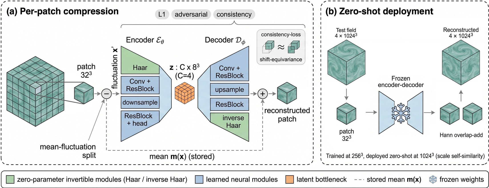
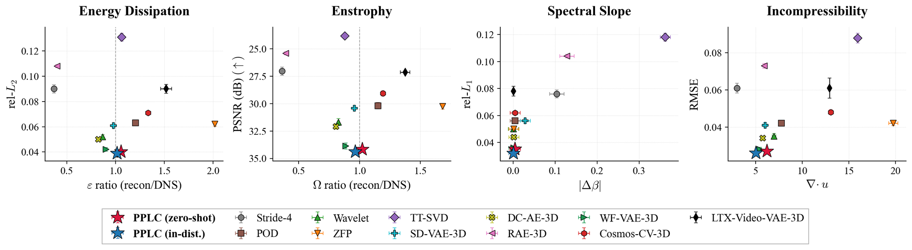
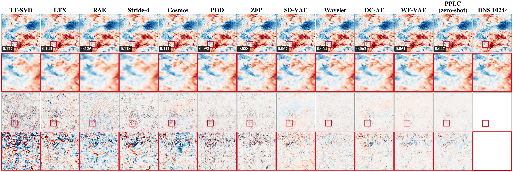
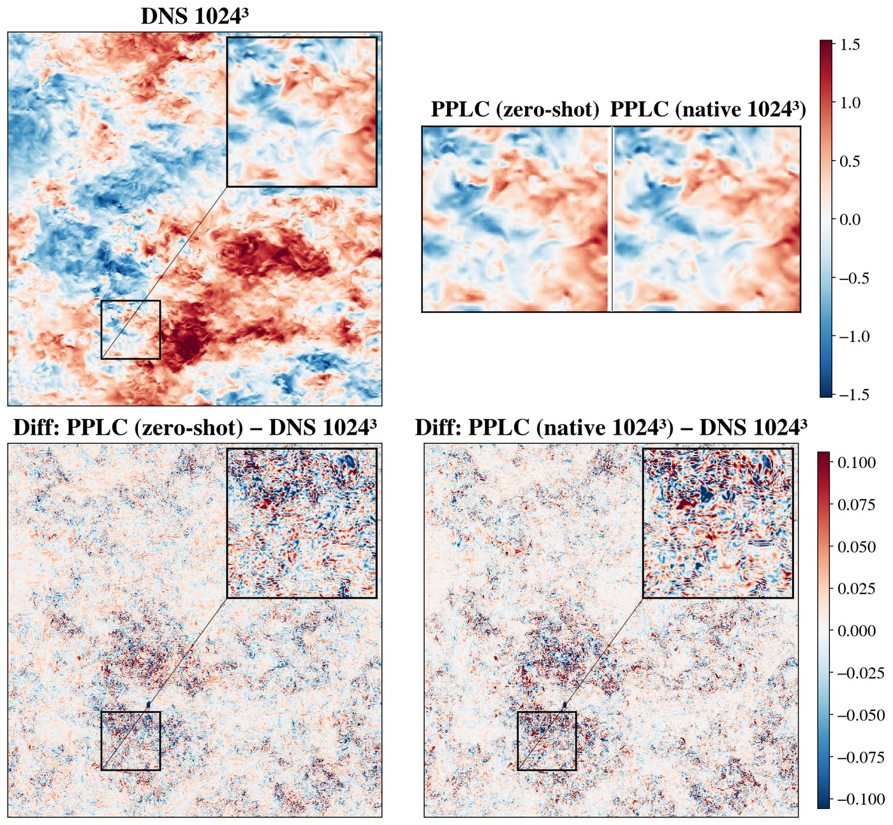
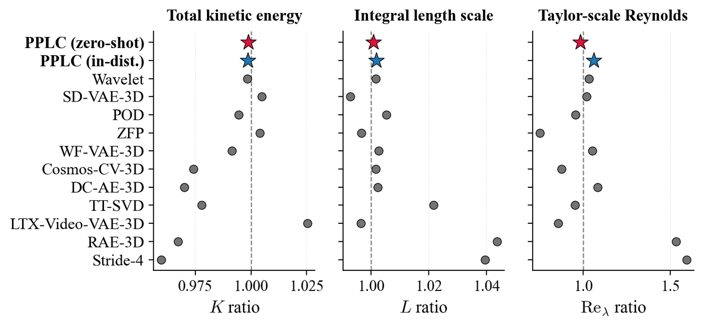
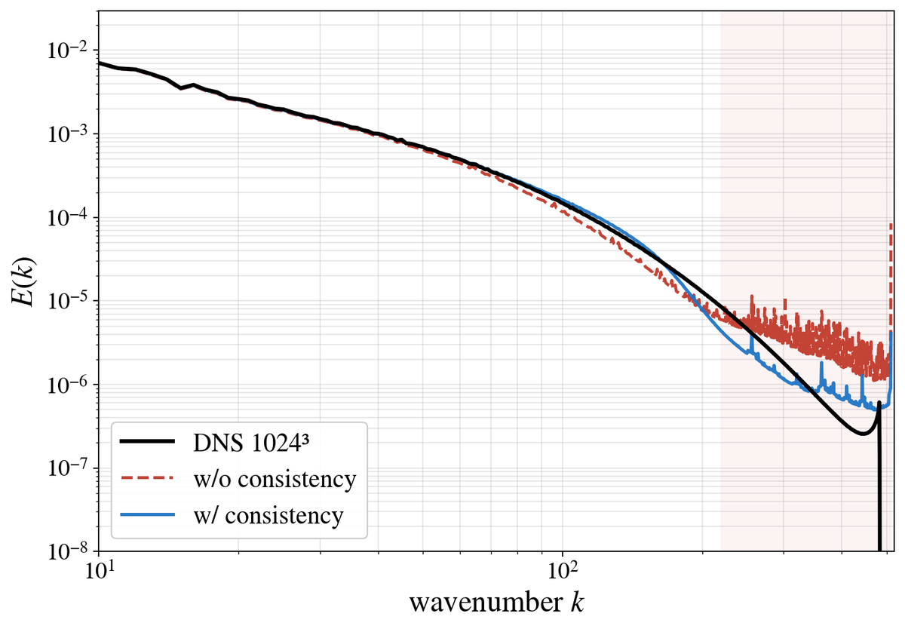

<p align="center">
<h1 align="center"><strong>🌀 Physics-Preserving Latent Compression for<br>Zero-Shot Resolution Transfer in 3D Turbulence</strong></h1>
  <p align="center">
    <a href="https://scholar.google.com/citations?user=GsTyeUMAAAAJ&hl=en">Yilong Dai</a><sup>1</sup>,
    <a href="https://ymsun99.github.io/">Yiming Sun</a><sup>2</sup>,
    <a>Yiheng Chen</a><sup>1</sup>,
    <a href="https://www.zoe-wang.com/">Ziyi Wang</a><sup>3</sup>,
    <a href="https://www.linkedin.com/in/shengyuchen/">Shengyu Chen</a><sup>4</sup>,
    <a href="https://scholar.google.com/citations?user=mIvajOgAAAAJ&hl=en">Xiaowei Jia</a><sup>2</sup>,
    <a href="https://runlongyu.github.io/">Runlong Yu</a><sup>1,&dagger;</sup>
    <br>
    <sup>1</sup>The University of Alabama &nbsp;·&nbsp;
    <sup>2</sup>Rutgers University &nbsp;·&nbsp;
    <sup>3</sup>Texas A&amp;M University &nbsp;·&nbsp;
    <sup>4</sup>University of Pittsburgh
    <br>
    <sup>&dagger;</sup>Corresponding author &nbsp;·&nbsp; <code>ryu5@ua.edu</code>
  </p>

<p align="center">
  <a href="https://arxiv.org/abs/2606.21781" target="_blank">
    
  </a>
  <a href="https://icdm2026.org" target="_blank">
    
  </a>
  <a href="https://turbulence.pha.jhu.edu/" target="_blank">
    
  </a>
  <a href="https://github.com/Dyloong1/PPLC4ICDM/blob/main/LICENSE" target="_blank">
    
  </a>
  
  
</p>

<p align="center">
  
  <br>
  <em>PPLC compresses each fixed-size patch independently (a), so the same encoder–decoder
  runs unchanged on a much finer grid at test time (b).</em>
</p>

> **TL;DR** — Train a compressor on cheap 256³ turbulence, run it **zero-shot on 1024³** at
> **64× compression**, and keep the physics: dissipation, enstrophy, energy spectrum, and
> incompressibility all stay close to DNS. The trick is that a fixed-size patch is a
> *transferable unit* under inertial-range scale similarity — so nothing in the model
> depends on the global grid size.

---

## ✨ Highlights

- **Zero-shot across resolutions.** Trained only on stride-downsampled 256³ fields; evaluated on
  native 1024³ frames it never saw. The 4× resolution jump costs **~0.001 rel-L2**.
- **Beats compressors trained *at* the test resolution.** rel-L2 **0.040** / PSNR **34.17 dB**,
  ahead of every 1024³-native learned baseline (best: WF-VAE-3D at 0.042 / 33.87 dB).
- **Physics stays put.** Enstrophy ratio **Ω = 1.023** (closest to 1 of any method) and the three
  large-scale integral quantities *K, L, Re<sub>λ</sub>* rank **first** (0.999 / 1.001 / 0.982 vs DNS).
- **Fast.** A full 1024³ field reconstructs in **47 s** on one consumer GPU — ~2× faster than the
  strongest learned baseline.
- **A latent you can compute in.** Forecasting *inside* the latent beats pixel space by a wide
  margin (FSS **+0.070** vs **−0.110** with the same Transformer backbone).
- **Cheap data pipeline.** The 256³ training set is 251 GB instead of 15.7 TB — exactly 64× smaller.

---

## 📊 Main results — 64× compression, zero-shot on 1024³

Reconstruction and physics fidelity in one table. ε and Ω target **1**; **bold** = best,
<u>underline</u> = second. This is Table I of the paper.

| Method | rel-L1 ↓ | rel-L2 ↓ | RMSE ↓ | PSNR ↑ | ε →1 | Ω →1 | \|Δβ\| ↓ | ∇·u ↓ | Time(s) ↓ |
|---|---|---|---|---|---|---|---|---|---|
| *Per-frame analytic* ||||||||||
| Stride-4 <sup>♯</sup> | 0.076 | 0.090 | 0.061 | 27.04 | 0.369 | 0.362 | 0.104 | **2.99** | **18** |
| POD | 0.056 | 0.063 | 0.042 | 30.19 | 1.205 | 1.153 | 0.005 | 7.75 | 160 |
| Wavelet (db4, lvl 3) | 0.050 | 0.052 | 0.035 | 31.69 | 0.869 | 0.828 | **0.001** | 6.99 | 664 |
| ZFP | 0.050 | 0.062 | 0.042 | 30.25 | 2.019 | 1.684 | 0.002 | 19.76 | 151 |
| TT-SVD / MPS (bond 9) | 0.118 | 0.131 | 0.088 | 23.83 | 1.064 | 0.879 | 0.362<sup>‡</sup> | 15.94<sup>‡</sup> | 427 |
| *ML trained at 1024³* ||||||||||
| SD-VAE-3D | 0.056 | 0.061 | 0.041 | 30.42 | <u>0.979</u> | 0.957 | 0.029 | 6.02 | 94 |
| DC-AE-3D | 0.044 | 0.050 | 0.034 | 32.08 | 0.824 | 0.806 | 0.002 | 5.75 | 147 |
| RAE-3D | 0.104 | 0.108 | 0.073 | 25.42 | 0.400 | 0.393 | 0.128 | 5.92 | 80 |
| WF-VAE-3D | 0.036 | 0.042 | 0.028 | 33.87 | 0.902 | 0.888 | 0.002 | 5.45 | 95 |
| Cosmos-CV-3D <sup>♭</sup> | 0.062 | 0.071 | 0.048 | 29.07 | 1.333 | 1.191 | 0.005 | 13.05 | 112 |
| LTX-Video-VAE-3D <sup>♭</sup> | 0.078 | 0.090 | 0.061 | 27.14 | 1.519 | 1.376 | **0.001** | 12.93 | 474 |
| *Ours* ||||||||||
| **PPLC (zero-shot, 256³→1024³)** | <u>0.035</u> | <u>0.040</u> | <u>0.027</u> | <u>34.17</u> | 1.056 | **1.023** | 0.005 | 6.23 | <u>47</u> |
| *PPLC (trained at 1024³, control)* | **0.032** | **0.039** | **0.026** | **34.39** | **1.016** | <u>0.965</u> | **0.001** | <u>5.04</u> | <u>47</u> |

<sub>Learned rows use the same Hann overlap-add reassembly; analytic rows use their native global transform.
<sup>♯</sup>Stride-4's low divergence is an artifact of trilinear upsampling (smooth by construction), not fidelity.
<sup>‡</sup>TT-SVD's |Δβ| and ∇·u come from a legacy spectral operator; ε and Ω are unaffected.
<sup>♭</sup>Cosmos and LTX-Video are reported with naive reassembly: overlap-add diverges for Cosmos and badly degrades LTX-Video's slope error.</sub>

<p align="center">
  
  <br>
  <em>Each panel pairs a reconstruction metric with a physics metric; error bars are one standard
  deviation over the three test frames. Stars are our two variants — they sit in the favorable
  corner of every panel. (Paper Figure 2.)</em>
</p>

---

## 🖼️ Qualitative comparison

Thirteen methods on the same zero-shot 1024³ slice, ordered left → right by decreasing per-slice
rel-L2. Rows: reconstruction, zoom, error map, zoomed error map.

<p align="center">
  
  <br>
  <em>Weaker baselines either over-smooth the fine structure or leave a dense error field;
  PPLC's zoom and error map are the cleanest. (Paper Figure 3.)</em>
</p>

---

## 🔬 What does zero-shot actually cost?

We train an otherwise identical model **on native 1024³ patches** as a data control. The two differ
only in training data, so the gap is exactly the price of resolution transfer.

<p align="center">
  
  <br>
  <em>Top: DNS ground truth and the two reconstructions. Bottom: error maps with a magnified inset.
  Slice errors 0.0475 vs 0.0490 — the residuals differ in texture, not magnitude. (Paper Figure 5.)</em>
</p>

---

## 📈 Large-scale physics

<p align="center">
  
  <br>
  <em>Total kinetic energy K, integral length scale L, and Taylor-scale Reynolds number Re<sub>λ</sub>,
  as ratios to DNS (dashed line = ideal). PPLC ranks first on all three even though every baseline
  is trained natively at 1024³. (Paper Figure 4.)</em>
</p>

---

## 🧪 Ablation — what the shift-consistency loss buys

Aggregate metrics understate this one. Without the consistency loss the reconstructed spectrum
develops large spurious oscillations at high wavenumbers — exactly the small-scale content a
downstream simulator would consume.

<p align="center">
  
  <br>
  <em>High-wavenumber tail (shaded): oscillating without the loss, smooth and close to DNS with it.
  (Paper Figure 6.)</em>
</p>

| Variant | latent | λ<sub>c</sub> | rel-L2 ↓ | ε →1 | ∇·u ↓ |
|---|---|---|---|---|---|
| channel-heavy | 32×4³ | 0 | 0.076 | 1.32 | 14.97 |
| channel-heavy, +consist | 32×4³ | 0.1 | 0.074 | 1.20 | 14.65 |
| spatial-layout | 4×8³ | 0 | 0.062 | 1.27 | 17.6 |
| spatial, +consist (naive) | 4×8³ | 0.1 | 0.052 | 1.19 | 9.75 |
| **+ Hann (ours)** | **4×8³** | **0.1** | **0.040** | **1.06** | **6.23** |

<sub>Paper Table II. The latent *shape* — not the seam — dominates divergence; the consistency loss
and the overlap-add then clean up the boundaries at training and test time respectively.</sub>

---

## 🚀 Quick start (evaluate pretrained models, no training)

```bash
# 1. Environment
git clone https://github.com/Dyloong1/PPLC4ICDM.git
cd PPLC4ICDM
pip install -r requirements.txt

# 2. Download JHTDB test frames (800, 900, 1000 of isotropic1024coarse)
#    Requires a free JHTDB account: https://turbulence.pha.jhu.edu/
python data/download_jhtdb.py --frames 800 900 1000 --out data/jhtdb/

# 3. Download pretrained checkpoints (~3 GB)
bash checkpoints/download.sh

# 4. Reproduce Table I (~2 h on RTX 5090; the 4 analytic methods run on CPU)
python scripts/eval/zeroshot_1024.py \
    --method all --frames 800 900 1000 \
    --data_dir data/jhtdb/ --ckpt_dir checkpoints/ \
    --out_dir cache/zeroshot_1024/

python scripts/tables/table1_main.py \
    --cache_dir cache/zeroshot_1024/ --out tables/table1.md

# 5. Render the qualitative figure (cached slices + eval JSONs; < 60 s, no GPU)
python scripts/figures/fig1_baselines_with_error.py \
    --cache_dir cache/zeroshot_1024/ \
    --slices assets/slices_z512.npz \
    --out figures/fig1_baselines_with_error.png
```

Repeat steps 4–5 with `scripts/tables/table{2,3,4}_*.py` and `scripts/figures/fig{2,3,4}_*.py`
for the rest. **Every figure above regenerates in under a minute from the cached data already
shipped in `assets/` — no GPU and no JHTDB download needed.**

---

## 🔁 What's reproducible

| Paper asset | Reproduced by |
|---|---|
| **Table I** — 13 methods × 9 metrics, 3 zero-shot 1024³ frames | `scripts/tables/table1_main.py` |
| **Table II** — component ablation (channel-heavy → spatial → +consist → +Hann) | `scripts/tables/table2_ablation.py` |
| **Table III** — compression sweep (34×→254×) + train-resolution ablation | `scripts/tables/table3_compression_sweep.py` |
| **Table IV** — forecaster comparison (latent vs pixel, direct-τ vs AR) | `scripts/tables/table4_forecaster.py` |
| **Fig. 3** — qualitative baseline / zoom / error panel | `scripts/figures/fig1_baselines_with_error.py` |
| **Fig. 5** — zero-shot vs native-1024 comparison | `scripts/figures/fig2_zeroshot_vs_native.py` |
| **Fig. 6** — consistency-loss energy spectrum | `scripts/figures/fig3_ablation_consist_spectrum.py` |
| **Compression–fidelity Pareto curve** | `scripts/figures/fig4_compression_sweep_pareto.py` |

This repo is intentionally minimal — only the code paths that feed the paper are included;
~80 superseded ablations and auxiliary diagnostics from the working repo are out of scope.

---

## 🧠 Method in one minute

| Component | What it does | Why |
|---|---|---|
| **Patch-local VAE** | encodes 32³ patches independently | nothing depends on the global grid → resolution transfer |
| **Mean–fluctuation split** | stores 4 per-patch means exactly, encodes the zero-mean rest | means are lossless and cheap; capacity goes to the turbulent fluctuation |
| **Haar front-end** | single-level, invertible, parameter-free | shortest orthogonal filters → stays inside the patch, no boundary padding |
| **Spatial latent 4×8³** | keeps spatial extent instead of folding it into channels | preserves neighborhood structure a downstream simulator needs |
| **Shift-consistency loss** | penalizes ‖D(E(S<sub>k</sub>x)) − S<sub>k</sub>D(E(x))‖₁ | makes the patch map insensitive to where a boundary falls |
| **Hann overlap-add** | half-stride decode, windowed sum | blends the seams that survive training; parameter-free, no retraining |

---

## 📂 Repo layout

```
PPLC4ICDM/
├── pplc/                    ← the method
│   ├── model.py             ← spatial-8 4-channel PPLC architecture
│   ├── haar_wavelet.py      ← invertible 3D Haar front-end
│   ├── losses.py            ← L1 + grad + KL + adversarial + consistency
│   ├── reassemble.py        ← naive + Hann overlap-add reassembly
│   └── dataset.py           ← 32³ patch loader from 256³ frames
│
├── baselines/
│   ├── analytic/            ← Stride-4, POD, Wavelet, ZFP, TT-SVD
│   └── learned/             ← SD-VAE, DC-AE, RAE, WF-VAE, Cosmos, LTX-Video (all 3D)
│
├── forecasters/             ← Table IV: latent/pixel × Transformer/UNet
├── physics/                 ← shared metrics: ε, Ω, β, divergence, E(k)
├── scripts/                 ← train / eval / tables / figures
├── configs/                 ← all hyperparameters in YAML
├── data/                    ← JHTDB downloader
├── checkpoints/             ← pretrained weights + download.sh
└── assets/                  ← cached eval JSONs, slice NPZ, README figures
```

---

## 🗄️ Dataset

JHTDB [`isotropic1024coarse`](https://turbulence.pha.jhu.edu/datasets.aspx) — a public DNS of
forced homogeneous isotropic turbulence, four channels (u, v, w, p) on a periodic [0, 2π]³ domain
with ν = 1.85 × 10⁻⁴. We measure Re<sub>λ</sub> ≈ 418 over our evaluation frames.

| | Train | Val | Test |
|---|---|---|---|
| **Compressor** (PPLC + 6 learned baselines) | frames 0–699, 256³ (stride-4 from 1024³) | 700–799, 256³ | **800 / 900 / 1000 at full 1024³** |
| **Forecaster** (Table IV) | frames 0–799, 256³ | 800–899, 256³ | 900–999, 256³ |

The 1024³ test frames are **never seen during training** — that is what makes the headline
setting zero-shot. The forecasting study is deliberately in-distribution at 256³ and kept
separate from the zero-shot claim. Full details in [`data/README.md`](data/README.md).
- **Storage** — one 1024³ frame is 16 GB in single precision; its stride-4 256³ counterpart
  is 256 MB. Across the training set: **251 GB instead of 15.7 TB**.

---

## 💾 Pretrained models

A public checkpoint release (Zenodo / Hugging Face) is being prepared. `bash checkpoints/download.sh` fetches:

- `pplc_64x.pt` — headline zero-shot model (trained on 256³)
- `pplc_native_1024.pt` — the 1024³-trained data control
- `baselines/<name>_3d.pt` — six learned baselines
- `forecasters/<name>.pt` — four forecasters
- `pod_basis_K2048.npy` — precomputed POD basis (~6 GB, optional)

---

## 📄 Citation

```bibtex
@misc{dai2026physicspreservinglatentcompressionzeroshot,
      title={Physics-Preserving Latent Compression for Zero-Shot Resolution Transfer in 3D Turbulence}, 
      author={Yilong Dai and Yiming Sun and Yiheng Chen and Ziyi Wang and Shengyu Chen and Xiaowei Jia and Runlong Yu},
      year={2026},
      eprint={2606.21781},
      archivePrefix={arXiv},
      primaryClass={physics.flu-dyn},
      url={https://arxiv.org/abs/2606.21781}, 
}
```

## ⚖️ License

MIT. JHTDB data is governed by the [JHTDB Terms of Use](https://turbulence.pha.jhu.edu/).
